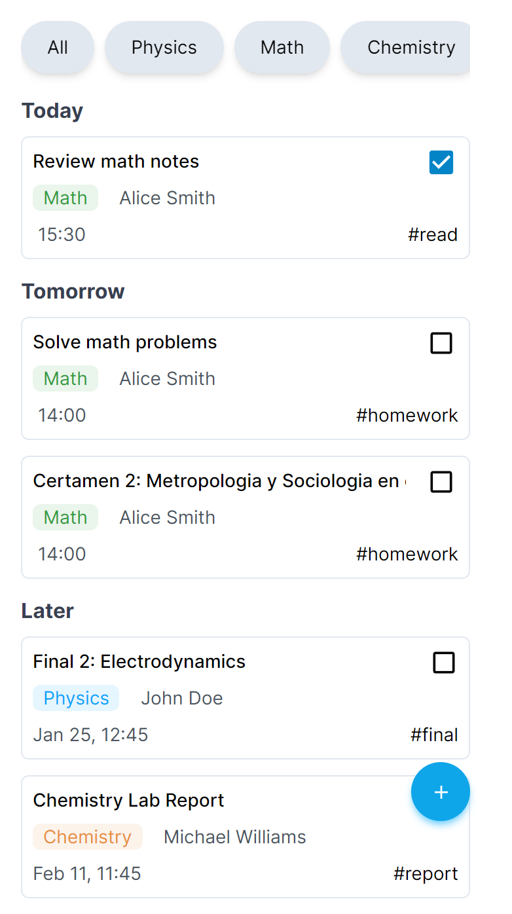

# Homework Tracker



Homework Tracker is a mobile-first web application developed using React, Tailwind CSS, and CSS. It allows users to efficiently manage and track their homework tasks. The application includes features such as a course search bar, task categorization by Today, Tomorrow, and Later, time/date of tasks, course teacher information, and task tags.

## Table of Contents

- [Demo](#demo)
- [Features](#features)
- [Tech Stack](#tech-stack)
- [Installation](#installation)
- [Usage](#usage)

## Demo

Include a link to a live demo or screenshots of your application to provide users with a visual understanding of your project.

## Features

- **Mobile-First Design:** Developed with a mobile-first approach for a responsive user experience across various devices.

- **Course Search Bar:** Easily search and filter courses using a dedicated search bar.

- **Task Categorization:** Tasks are organized into categories like Today, Tomorrow, and Later for efficient task management.

- **Time/Date of Task:** Each task displays its associated time and date for better scheduling.

- **Course Teacher Information:** Users can view information about the teacher associated with each course.

- **Tags:** Tasks can be tagged for easy categorization and identification.

## Tech Stack

- **React:** A JavaScript library for building user interfaces.

- **Tailwind CSS:** A utility-first CSS framework for rapidly building custom designs.

- **CSS:** Additional custom styling to enhance the visual appeal and user experience.

## Installation

1. Clone the repository:

    ```bash
    git clone https://github.com/jhossepmartinez/homework-tracker.git
    ```

2. Install dependencies:

    ```bash
    cd homework-tracker
    npm install
    ```

## Usage 

1. Start development server

    ```bash
    npm run dev
    ```

2. Open your browser and go to `http://localhost:5173/` (Default react port) or check the local host in the terminal.

3. Enable devTools and change to mobile view since some features are broken in desktop view.


